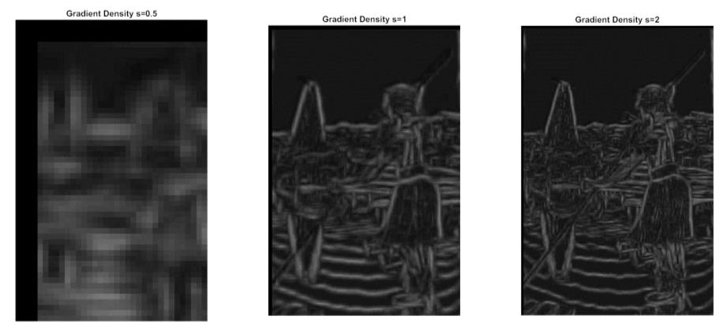
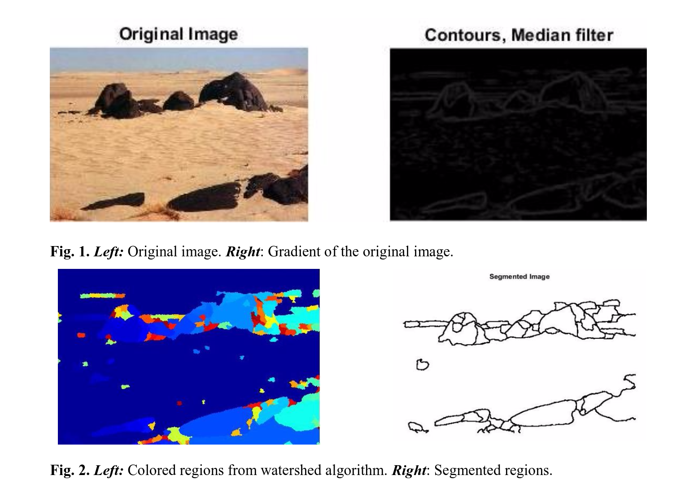

# Advanced Digital Image Processing - Project Work
This is a project about digital image processing, with particular regard to image segmentation. 

The goals are: 
<ul>
<li>Implement an efficient approach to estimate the oriented gradient of histograms. </li>
<li>Utilize the local minimum of the latter as a seed for a morphological watershed segmentation</li>
</ul>

### Results

We successfully managed to achieve both tasks. See "Final Report" to get an intro to the topics of this research and the presentation of our work. 
The idea behind the actual implementation of the algorithm is based on the paper from Arbelaez. The former is in the docs folder together with some other useful document and our presentations. 

### Gradient of Histogram  
#### Influence of scale in gradients' magnitudes 
Big scales images give rise to fine contours in contrast with the coarse contours acquired in the smaller scale image.

#### Influence of θ in gradients’ magnitudes
Using one single orientation (θ=0°,90°,45°,125°) is not enough to acquire contour quality, but the combination of all give rise to an efficient contour detector.

### Watershed Segmentation 

