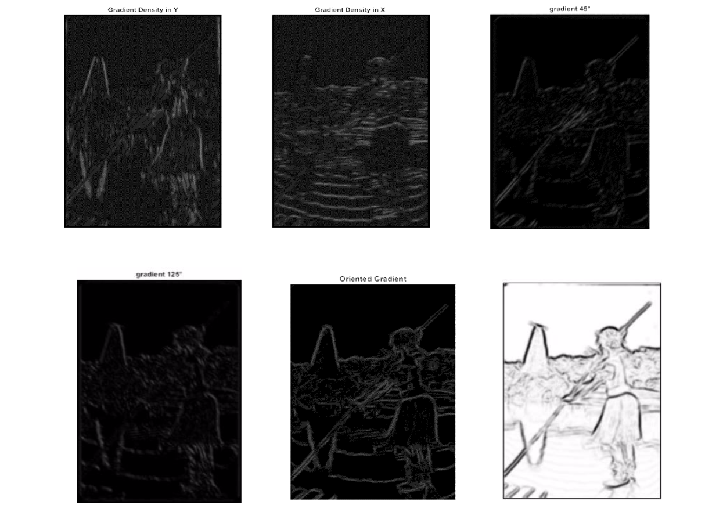

# Advanced Digital Image Processing - Project Work
This is a project about digital image processing, with particular regard to image segmentation. 

The goals are: 

- Implement an efficient approach to estimate the oriented gradient of histograms. </li>
- Utilize the local minimum of the latter as a seed for a morphological watershed segmentation

This repository implements the work described in:   

> **Contour Detection and Hierarchical Image Segmentation**  
> **P. Arbelaez, M. Maire, C. Fowlkes and J. Malik.**
> IEEE TPAMI, Vol. 33, No. 5, pp. 898-916, May 2011
> http://www.eecs.berkeley.edu/Research/Projects/CS/vision/grouping/papers/amfm_pami2010.pdf

### Results

We successfully managed to achieve both tasks. See "Final Report" to get an intro to the topics of this research and an overview of our work. 
The `docs` folder contains our presentation at a student conference inside Delft University of Technology. 

### Gradient of Histogram  
#### Influence of scale in gradients' magnitudes 
Big scales images give rise to fine contours in contrast with the coarse contours acquired in the smaller scale image.

#### Influence of θ in gradients’ magnitudes
Using one single orientation (θ=0°,90°,45°,125°) is not enough to acquire contour quality, but the combination of all give rise to an efficient contour detector.

### Watershed Segmentation 

